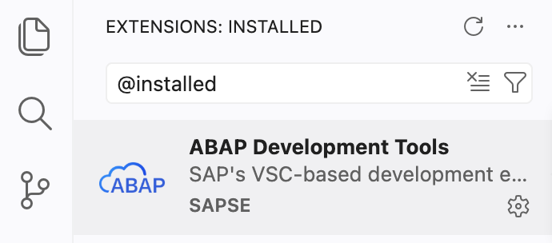
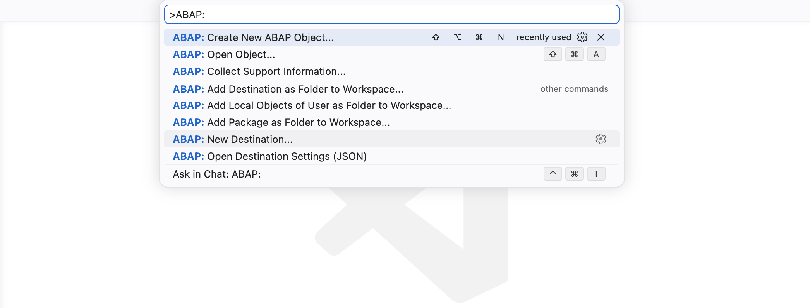

[Home - Build an ABAP Travel Application with GitHub Copilot and ADT in Visual Studio Code](../../README.md)

# Getting Started

## Introduction

Welcome to **RAP130**! Before building your ABAP Travel console application, you need to set up your development environment in **Visual Studio Code** and connect it to your ABAP system.

In this exercise, you will install Visual Studio Code, install the ADT for Visual Studio Code extension, and establish a connection to your ABAP system.

### Exercises

- [0.1 - Define your Group ID](#exercise-01-define-your-group-id)
- [0.2 - Install Visual Studio Code](#exercise-02-install-visual-studio-code)
- [0.3 - Install the ADT for Visual Studio Code Extension](#exercise-03-install-the-adt-for-visual-studio-code-extension)
- [0.4 - Connect Visual Studio Code to Your ABAP Cloud System](#exercise-04-connect-visual-studio-code-to-your-abap-system)
- [0.5 - Explore the Visual Studio Code User Interface for ABAP Development](#exercise-05-explore-the-visual-studio-code-user-interface-for-abap-development)
- [Summary](#summary)

> ℹ️ **Reminder**: You will define a **Group ID** in section 0.1. Use `####` for your four-digit group ID in class and table names. All workshop objects belong to the existing package `$TMP`.

---

## Exercise 0.1: Define your Group ID
[^Top of page](#)

> In this exercise, you will define a group ID that you will need throughout this workshop to uniquely identify your repository artifacts and avoid conflicts with other participants using the same system.

<details>
  <summary>🔵 Click to expand!</summary>

As the ABAP environment is shared by many participants, every artifact you create follows a naming pattern using a personal suffix.

Class and table names use **`####`** for your four-digit group ID. Create all workshop objects in the existing local package **`$TMP`**. No package creation is required.

The group ID must contain **exactly four digits** — e.g. `0123`, `1042`, or `2026`. Preserve leading zeros in every object name.

**Check for already-used group IDs:**

1. Once your Visual Studio Code is connected (see Exercise 0.4), open the **Command Palette** with **`Ctrl+Shift+P`** (macOS: **`Cmd+Shift+P`**).

2. Type `>ABAP: Open Object` and press **Enter**.

3. Search for **`YCL_TRAVEL*####`**, replacing `####` with your chosen suffix. If results appear, the group ID is already taken — try another one.

4. Also search for `YTRAVEL####`, `YBOOKING####`, and `YCL_TRAVEL*####`. Only use the suffix if none of these workshop objects exists. Note it down and use it consistently throughout all exercises.

> ⚠️ We **do not recommend** using group ID **`0000`**. Choose a four-digit number that is unique to you.

> ⚠️ For SAP-led workshops, a group ID **`####`** will be provided by the instructor.

</details>

---

## Exercise 0.2: Install Visual Studio Code
[^Top of page](#)

> Download and install Visual Studio Code on your system if you have not already done so.

<details>
  <summary>🔵 Click to expand!</summary>

1. Open a browser and go to [https://code.visualstudio.com/](https://code.visualstudio.com/).

2. Download the installer for your operating system (Windows, macOS, or Linux).

3. Run the installer and follow the on-screen instructions.

4. Launch **Visual Studio Code** once installation is complete.

   > ℹ️ **Hint**: Ensure you are running a recent stable version of Visual Studio Code. Go to **Help > About** to check your version.

</details>

---

## Exercise 0.3: Install the ADT for Visual Studio Code Extension
[^Top of page](#)

> Install the **ABAP Development Tools (ADT)** extension for Visual Studio Code from the Visual Studio Marketplace. This extension connects Visual Studio Code to your ABAP backend and includes the built-in **ADT MCP Server** that you will use in Exercise 1.

<details>
  <summary>🔵 Click to expand!</summary>

### Step 1: Install from the Visual Studio Code Marketplace

1. Open **Visual Studio Code**.

2. Open the **Extensions** view:
   - Press **`Ctrl+Shift+X`** (macOS: **`Cmd+Shift+X`**), or
   - Click the **Extensions** icon in the Activity Bar (left edge)

3. In the search bar, type:
   ```
   ABAP Development Tools
   ```

4. Locate the **"ABAP Development Tools"** extension published by **SAP** and click **Install**.

5. Wait for the installation to complete.

   > ✅ **Success**: You should see "ABAP Development Tools" listed under **Installed** extensions.

   

### Step 2: Verify the installation

1. Open the **Command Palette** (**`Ctrl+Shift+P`**) and type `ABAP`. You should see ABAP-specific commands such as:
   - `ABAP: New Destination...`
   - `ABAP: Open Object...`
   - `ABAP: Create New ABAP Object...`
   - `ABAP: Activate`

   > ✅ If you see these commands, the extension is installed correctly.

   

</details>

---

Before continuing, install **GitHub Copilot** from the VS Code Extensions view, sign in with your GitHub account, and verify that Copilot Chat and Agent mode are available with your account.

## Exercise 0.4: Connect Visual Studio Code to Your ABAP System
[^Top of page](#)

> Create a **destination** in Visual Studio Code to connect to your ABAP system, then add it to your workspace.
>
> Choose the connection type that matches your system:
> - **HTTP** — SAP BTP ABAP Environment or SAP S/4HANA Cloud Public Edition
> - **RFC** — SAP S/4HANA on-premise or SAP S/4HANA Cloud Private Edition (requires SAP Logon configured on your machine)

<details>
  <summary>🔵 Click to expand!</summary>

### Option A: HTTP destination (Cloud systems)

1. Open the **Command Palette** (**`Ctrl+Shift+P`**).

2. Type `ABAP: New Destination` and select **"ABAP: New Destination..."**.

3. Select **HTTP** as the connection type.

4. Enter the **system URL** of your ABAP Cloud system. The URL format is:
   ```
   https://<system-id>.abap.<region>.hana.ondemand.com
   ```

5. Press **Enter**, then enter a short **ID** for this destination (e.g., `BTP_DEV`).

6. Press **Enter**. The connection is established.

   ```
   Command Palette → "ABAP: New Destination..."
     ↓
   Connection Type → HTTP
     ↓
   System URL → https://my-system.abap.eu10.hana.ondemand.com
     ↓
   Destination ID → BTP_DEV
     ↓
   ✅ Connection established!
   ```

---

### Option B: RFC destination (On-premise systems)

> ℹ️ **Prerequisite**: Your system must be configured in **SAP Logon** (SAP GUI) with RFC connectivity before proceeding.

1. Open the **Command Palette** (**`Ctrl+Shift+P`**).

2. Type `ABAP: New Destination` and select **"ABAP: New Destination..."**.

3. Select **RFC** as the connection type.

4. A list of systems from your **SAP Logon** configuration is displayed. Select your target system.

5. Enter your **username** and press **Enter**.

6. Enter the **client number** (e.g., `100`) and press **Enter**.

7. Enter your **login language** (e.g., `EN`) and press **Enter**.

8. The connection is established.

   ```
   Command Palette → "ABAP: New Destination..."
     ↓
   Connection Type → RFC
     ↓
   System → S4D - Development System
     ↓
   Username → DEVELOPER01
     ↓
   Client → 100
     ↓
   Language → EN
     ↓
   ✅ Connection established!
   ```

---

### Add the destination to your workspace

> ⚠️ **Important**: This step is required to activate the ADT extension and to start the local MCP server in Exercise 1.

1. Open the **Command Palette** (**`Ctrl+Shift+P`**).

2. Type `ABAP: Add Destination as Folder` and select **"ABAP: Add Destination as Folder to the Workspace..."**.

3. Select your newly created destination.

4. For **HTTP** systems: a browser window opens — log in with your ABAP system credentials.  
   For **RFC** systems: the connection is established immediately using your SAP Logon credentials.

5. After login, your system connection appears as a **folder** in the Visual Studio Code Explorer view (left sidebar).

</details>

---

## Exercise 0.5: Explore the Visual Studio Code User Interface for ABAP Development
[^Top of page](#)

> Get familiar with the key Visual Studio Code areas you will use throughout this workshop.

<details>
  <summary>🔵 Click to expand!</summary>

### Key UI areas for ABAP development

| Area | Location | Purpose |
|------|----------|---------|
| **Activity Bar** | Far left | Switch between Explorer, Search, Source Control, Run & Debug, Extensions |
| **Explorer (Workspace)** | Left sidebar | Navigate your ABAP system hierarchy — packages, object types, objects |
| **Editor** | Center | Edit ABAP source code (classes and database table definitions) |
| **Coding agent chat** (e.g. GitHub Copilot) | Right sidebar or panel | AI-powered chat — you will run MCP tool prompts here |
| **Problems Panel** | Bottom | Syntax errors and warnings |
| **ABAP Console** | Bottom | Travel application output |
| **Terminal** | Bottom | Integrated shell |
| **Status Bar** | Very bottom | Current line/column, language, connected system |


### Essential keyboard shortcuts

| Action | Windows/Linux | macOS |
|--------|---------------|-------|
| Command Palette | **`Ctrl+Shift+P`** | **`Cmd+Shift+P`** |
| Open ABAP Object | **`Ctrl+Shift+A`** | **`Cmd+Shift+A`** |
| Create ABAP Object | **`Ctrl+Shift+Alt+N`** | **`Cmd+Shift+Option+N`** |
| Activate object | **`Ctrl+F3`** | **`Cmd+F3`** |
| Activate all inactive | **`Ctrl+Shift+F3`** | **`Cmd+Shift+F3`** |
| Save | **`Ctrl+S`** | **`Cmd+S`** |
| Find/Replace | **`Ctrl+H`** | **`Cmd+H`** |
| Run ABAP Unit Tests | **`Ctrl+Shift+F10`** | **`Cmd+Shift+F10`** |

> ℹ️ **Hint**: Use **Find/Replace** (**`Ctrl+H`**) to replace `####` with your four-digit group ID. Keep the package name `$TMP` unchanged.

### Navigating your ABAP system

1. In the **Explorer** view, expand the folder for your system connection.

2. Navigate through the package hierarchy to find objects.

3. Use **`Ctrl+Shift+A`** to quickly open any object by name — you can use wildcards like `YCL_TRAVEL*####`.

4. Objects with unsaved backend changes are marked **(L)** — they must be **activated** (**`Ctrl+F3`**) to become active in the system.

</details>

---

## Summary
[^Top of page](#)

You have successfully:
- Defined your group ID (`####`) for artifact naming
- Installed Visual Studio Code
- Installed the ADT for Visual Studio Code extension (which includes the ADT MCP Server)
- Created an HTTP destination and connected Visual Studio Code to your ABAP Cloud system
- Added the destination to your workspace and authenticated
- Explored the key Visual Studio Code areas for ABAP development

You can continue with the next exercise — **[Exercise 1: Enable the ADT MCP Server](../ex01/README.md)**

---
