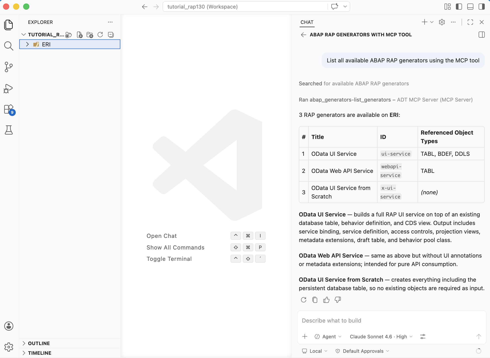

[Home - RAP130 - Build SAP Fiori Apps with ABAP Cloud and SAP Joule for Developers in Visual Studio Code](../../README.md)

# Exercise 1: Enable the ADT MCP Server 💎

## Introduction

In the previous exercise, you installed Visual Studio Code and the ADT for Visual Studio Code extension, and connected to your ABAP system (_see [Getting Started](../ex0/README.md)_).

In this exercise, you will enable the **ADT MCP Server** that is built into the ADT for Visual Studio Code extension, and verify that the MCP tools are available.

The ADT MCP Server exposes ABAP development capabilities as **Model Context Protocol (MCP) tools** — allowing you to create packages, create transports, generate complete RAP applications, activate objects, and more through natural language prompts. For more information, see [Agentic AI for ABAP Development](https://help.sap.com/docs/abap-cloud/abap-development-tools-for-visual-studio-code/agentic-ai-development?locale=en-US)

### Exercises

- [1.1 - Enable the ADT MCP Server in Visual Studio Code Settings](#exercise-11-enable-the-adt-mcp-server-in-visual-studio-code-settings)
- [1.2 - Verify the MCP Server is Running](#exercise-12-verify-the-mcp-server-is-running)
- [1.3 - Verify the ADT MCP Tools in your coding agent](#exercise-13-verify-the-adt-mcp-tools-in-your-coding-agent)
- [Summary & Next Exercise](#summary--next-exercise)

> ℹ️ **Reminder**: Don't forget to replace all occurrences of the placeholder **`###`** with your group ID in the exercise steps below.

---

## About the ADT MCP Server 💎

The **ADT MCP Server** is a local HTTP server that runs inside the ADT for Visual Studio Code extension. It implements the **Model Context Protocol (MCP)**, an open standard that allows AI assistants (like GitHub Copilot) to call tools in a structured, authenticated way.

When enabled, the MCP server exposes a set of ABAP development tools to any MCP-compatible AI client. In this workshop, the exercises use **GitHub Copilot** as the client. Any coding agent that supports Visual Studio Code's virtual workspace filesystem is compatible — GitHub Copilot is confirmed; others are also supported.

**Key tools available via the ADT MCP Server:**

| Tool | Description |
|------|-------------|
| `abap_activate-objects` | Activates ABAP objects in the backend system |
| `abap_business_services-fetch_service_information` | Fetches OData service metadata |
| `abap_creation-create_object` | Creates ABAP development objects |
| `abap_generators-list_generators` | Lists available ABAP RAP generators |
| `abap_generators-get_schema` | Retrieves the JSON schema for a generator |
| `abap_generators-generate_objects` | **Runs a RAP generator** — the key tool for Exercise 2 |
| `abap_run_unit_tests` | Runs ABAP unit tests for a given set of objects |
| `abap_transport-create` | Creates a transport request |
| `abap_transport-get` | Gets relevant transport requests for an object |

See [ADT MCP Tools](https://help.sap.com/docs/abap-cloud/abap-development-tools-for-visual-studio-code/mcp-tools?locale=en-US) for the complete list of tools available.

> ⚠ **Warning regarding AI outputs** ⚠
> The ADT MCP Server is an **experimental feature** that may change at any time without notice. It is not intended for productive use. Please back up your data before using it.

> **Further reading**: [Model Context Protocol (MCP)](https://modelcontextprotocol.io/)

---

## Exercise 1.1: Enable the ADT MCP Server in Visual Studio Code Settings
[^Top of page](#)

> Enable the built-in ADT MCP Server in the Visual Studio Code extension settings.

<details>
  <summary>🔵 Click to expand!</summary>

1. Open **Visual Studio Code Settings**:
   - Open the **Command Palette** with **`Ctrl+Shift+P`** (macOS: **`Cmd+Shift+P`**)
   - Type `Preferences: Open Settings (UI)` and select **Preferences: Open Settings...**.

2. In the search bar, type:
   ```
   adt mcp
   ```

3. Locate the setting **"Adt: Enable MCP Server"** (or similar) and **enable it** by checking the checkbox.

   > ℹ️ **Hint**: You can also switch to JSON mode (click the `{}` icon top-right in Settings) and add:
   > ```json
   >  "adt.mcpServer.enabled": true
   > ```

4. Optionally, you can configure the **MCP server port** (default: `2236`). Only change this if port 2236 is occupied on your machine:
   - Search for `ADT MCP port` in Settings
   - Set it to any available port between `0` and `65535`

5. **Reload Visual Studio Code** if prompted, or close and reopen the application.

   

> ⚠️ **Important**: Make sure your system destination is still added to the workspace (from Exercise 0.4). The MCP server only starts once a destination is active in the workspace.

</details>

---

## Exercise 1.2: Verify the MCP Server is Running
[^Top of page](#)

> Confirm that the ADT MCP Server started successfully.

<details>
  <summary>🔵 Click to expand!</summary>

After enabling the setting and having a destination in the workspace, the server should start automatically.

### Method 1: Check for the startup notification

1. Look at the **bottom-right corner** of Visual Studio Code for a notification:
   ```
   ADT MCP Server running on port 2236
   ```

   

   > ℹ️ If you don't see the notification, proceed to Method 2.

### Method 2: Check via MCP Server list

1. Open the **Command Palette** (**`Ctrl+Shift+P`**).

2. Type:
   ```
   >MCP: List Servers
   ```

3. Select **"MCP: List Servers"** from the list.

4. You should see an entry for **ADT MCP Server** in the quick pick list.

5. Select it and click **Start Server** if it is not already running.

   

### Troubleshooting

If the ADT MCP Server does not appear or fails to start:

1. **Disable and re-enable** the "Adt: Enable MCP Server" setting.
2. **Remove** the destination folder from the workspace and **add it back** (Command Palette → `ABAP: Add Destination as Folder to the Workspace...`).
3. **Restart** Visual Studio Code.

</details>

---

## Exercise 1.3: Verify the ADT MCP Tools in your coding agent
[^Top of page](#)

> Open your coding agent in agent mode and confirm that the ADT MCP tools are loaded and available.

<details>
  <summary>🔵 Click to expand!</summary>

1. Open **GitHub Copilot Chat** in Visual Studio Code:
   - Click the **Copilot icon** in the Activity Bar (left), or
   - Press **`Ctrl+Shift+I`** (macOS: **`Cmd+Shift+I`**)

2. Switch the chat mode to **"Agent"** in the chat dropdown.

   > ℹ️ **Note**: MCP tools are only available in **Agent mode** — not in the standard Ask or Edit modes.

3. Click the **"Configure Tools"** (tools wrench icon) button in the Copilot chat input bar.

4. A quick pick list appears showing available tool providers. You should see:
   - **ADT MCP Server** with a list of tools below it (e.g., `abap_generators-list_generators`, `abap_creation-create_object`, etc.)


   > ✅ If you see the ADT MCP Server and its tools listed, your setup is complete!

   

5. Make sure the ADT MCP Server tools are **checked/enabled** in the list.

6. **Sanity test** — type the following prompt in your coding agent's chat and press **Enter**:
   ```
   List all available ABAP RAP generators using the MCP tool.
   ```

   Your coding agent will request to call the `abap_generators-list_generators` tool. **Allow** the tool call when prompted.

   You should see a list of available generators returned, including an entry for **"OData UI Service from Scratch"**.

   > ✅ If you see generator names returned, the ADT MCP Server is working correctly with your coding agent!
   
   

</details>

---

## Summary & Next Exercise
[^Top of page](#)

Now that you've:
- Enabled the ADT MCP Server in Visual Studio Code extension settings
- Verified the server is running (via notification or `MCP: List Servers`)
- Confirmed that the ADT MCP tools are visible and callable from your coding agent in agent mode

you can continue with the next exercise — **[Exercise 2: Generate the SAP Fiori App via MCP Tools](../ex02/README.md)**

---
