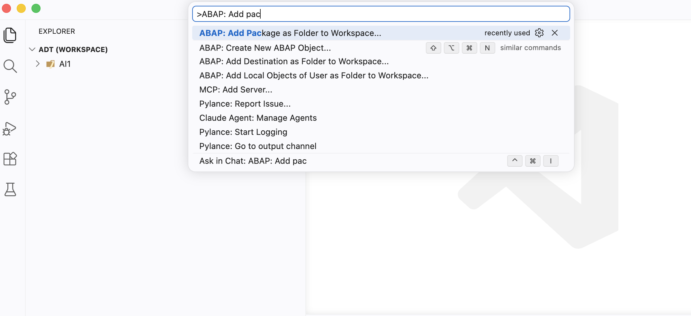
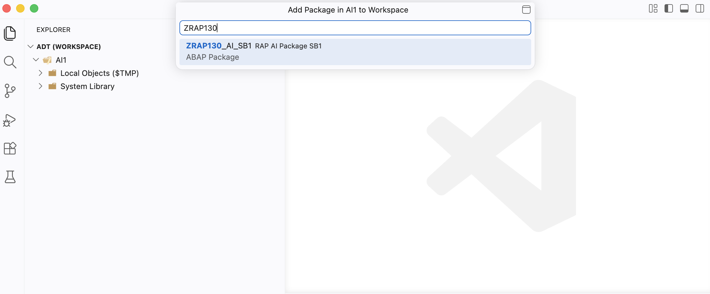
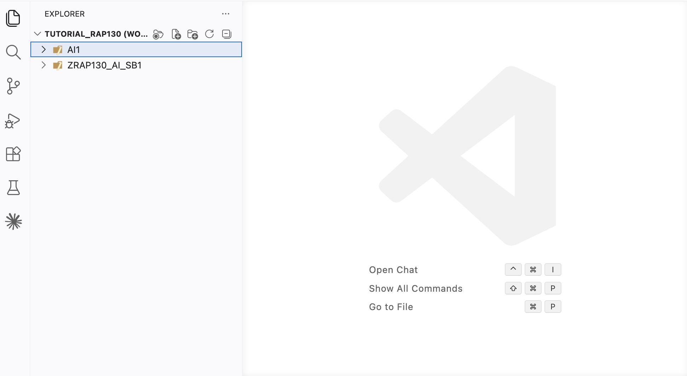
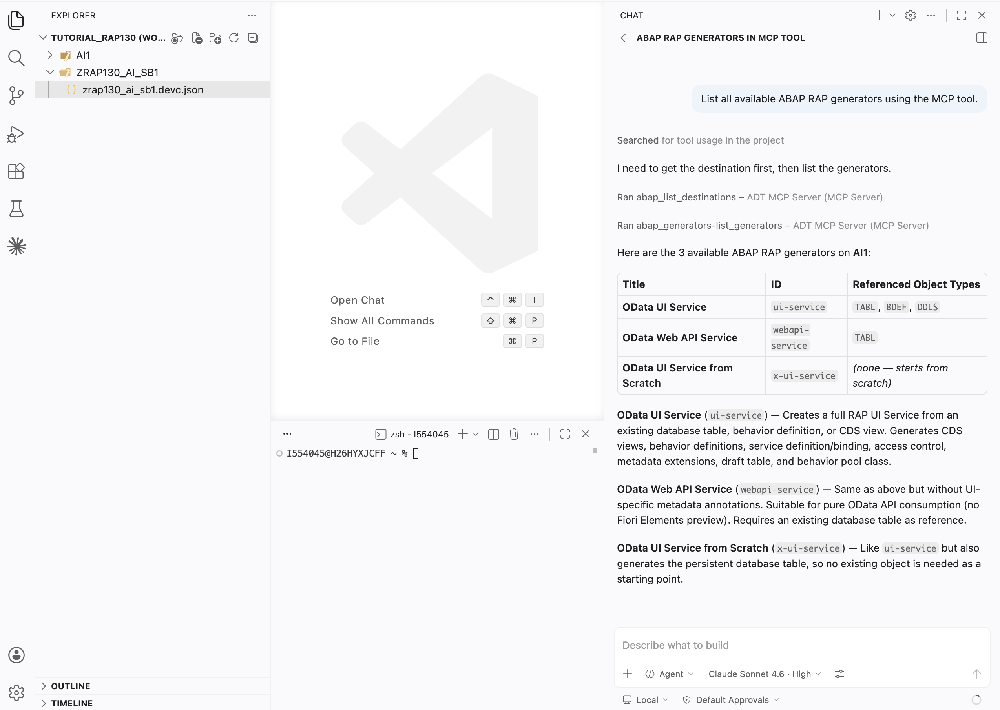
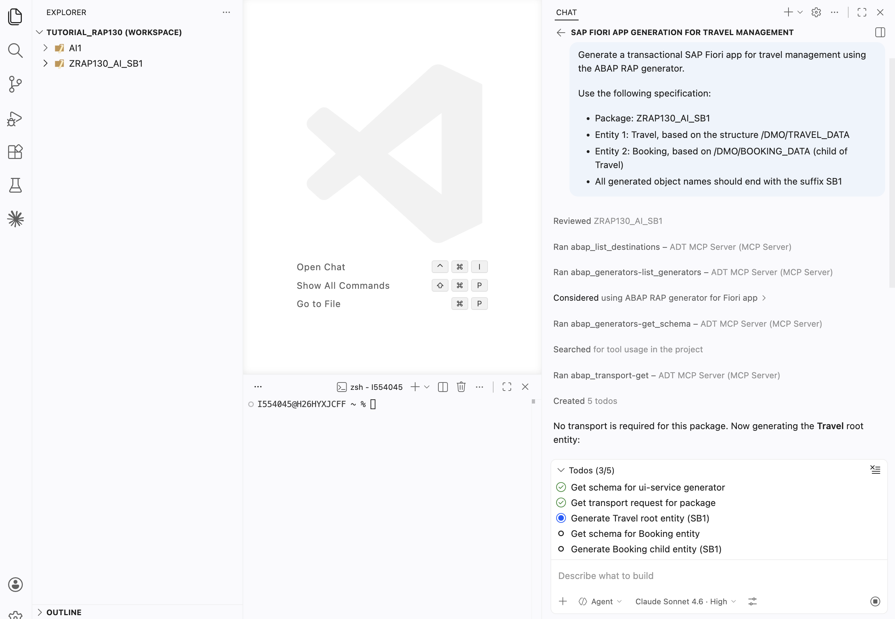
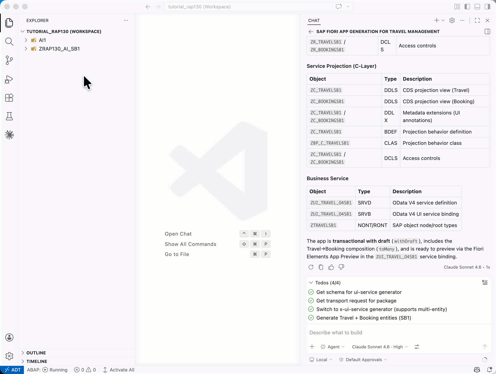

[Home - RAP130 - Build SAP Fiori Apps with ABAP Cloud and SAP Joule for Developers in Visual Studio Code](../../README.md)

# Exercise 2: Generate the SAP Fiori App via MCP Tools

## Introduction

In the previous exercise, you enabled the ADT MCP Server and verified that your coding agent can call the available ADT MCP tools (_see [Exercise 1](../ex01/README.md)_).

In this exercise, you will use **your coding agent in agent mode** together with the ADT MCP tools to:
1. Create your ABAP development package in ADT for Eclipse
2. Generate a complete transactional SAP Fiori app (Travel + Booking RAP business object) using the ABAP Cloud Generator — all driven by natural language prompts in the coding agent chat

### Exercises

- [2.1 - Create the ABAP Package](#exercise-21-create-the-abap-package)
- [2.2 - Generate the Transactional UI Service](#exercise-22-generate-the-transactional-ui-service)
- [Summary & Next Exercise](#summary--next-exercise)

> ℹ️ **Reminder**: Don't forget to replace all occurrences of the placeholder **`###`** with your group ID in the exercise steps below.

---

## About the ABAP Cloud Generator — Transactional App from Scratch

The **ABAP Cloud Generator: OData UI Service from Scratch** generates a complete RAP stack from a natural language description of the data model. It creates:

- Database tables (one per entity)
- CDS base views (interface views)
- CDS projection views (consumption views)
- Metadata extensions (UI annotations)
- Behavior definition 
- Behavior implementation class
- Service definition
- Service binding

In [RAP120](https://github.com/SAP-samples/abap-platform-rap120) (Eclipse ADT), this generator was triggered via a `Generate ABAP Repository Object > OData UI Service from Scratch`. In **RAP130**, the generator is exposed as MCP tool — called by your coding agent from the chat window in Visual Studio Code.

> ⚠ **Warning regarding AI outputs** ⚠
> The names of generated artifacts, database fields, and other elements may differ from those shown in this tutorial, as they are generated by AI. **Always review the generated artifacts before continuing.**

---

## Exercise 2.1: Create the ABAP Package
[^Top of page](#)

> Create your exercise package **`ZRAP130_AI_###`** in **ADT for Eclipse**. 

> ℹ️ **Coming soon**: Package creation directly from Visual Studio Code will be available in an upcoming release of the ADT for Visual Studio Code extension.

<details>
  <summary>🔵 Click to expand!</summary>

1. Open **Eclipse ADT** and connect to your ABAP system.

2. In the **Project Explorer**, expand your system connection and right-click on **`ZLOCAL`** → **New → ABAP Package**.

3. Fill in the package details:
   - **Name**: `ZRAP130_AI_###` (replace `###` with your group ID)
   - **Description**: `RAP AI Package ###`
   - **Superpackage**: `ZLOCAL`
   - **Package Type**: `Development`

4. Click **Next** (or **Finish**), and assign the package to a transport request if prompted.

5. Verify the package **`ZRAP130_AI_###`** appears in the Project Explorer under `ZLOCAL`.

6. Switch back to **Visual Studio Code**. You can add the created package to your workspace.

   Open the **Command Palette** with **`Ctrl+Shift+P`** (macOS: **`Cmd+Shift+P`**) and Type `>ABAP: Add Package as Folder to Workspace` and press **Enter**.

   

   Fill with your package's name `ZRAP130_AI_###` and then press **Enter**

   

   The workspace should look like this: 
   
   

</details>

---

## Exercise 2.2: Generate the Transactional UI Service
[^Top of page](#)

> Use ADT MCP tools to generate a complete RAP transactional OData UI service for Travel and Booking entities.

> ⚠ **Warning regarding AI outputs** ⚠
> Please be aware that the outputs generated by AI in this exercise description may differ from yours. **Always review the generated code and artifacts.**

<details>
  <summary>🔵 Click to expand!</summary>

### Step 1: Discover the available generators

1. In **your coding agent (Agent mode)**, type:

   ```
   List all available ABAP RAP generators using the MCP tool.
   ```

   

### Step 2: Get the generator schema (optional)

3. To understand the required input parameters, you can ask your coding agent:

   ```
   Get the JSON schema for the OData UI Service from Scratch generator.
   ```

4. Allow the `abap_generators-get_schema` tool call. Review the schema — it shows what fields the generator expects (entity names, field lists, suffixes, etc.).

### Step 3: Run the generator

5. In **your coding agent (Agent mode)**, copy and paste the following prompt. Replace **`###`** with your group ID:

   ```
   Generate a transactional SAP Fiori app for travel management using the ABAP RAP generator.

   Use the following specification:
   - Package: ZRAP130_AI_###
   - Entity 1: Travel, based on the structure /DMO/TRAVEL_DATA
   - Entity 2: Booking, based on the structure /DMO/BOOKING_DATA (child of Travel)
   - All generated object names should end with the suffix "###"
   ```

6. Your coding agent will plan the generation. It will likely call:
   - `abap_generators-get_schema` — to retrieve the generator input schema
   - `abap_generators-generate_objects` — to execute the generation

   **Allow each tool call** when prompted.

   > ℹ️ **Note**: The generator may take a moment to run. Progress will be shown.

   

### Step 4: Review the generated objects

7. Once the generator completes, your coding agent will report the list of generated objects. You should see entries for:
   - Database tables: **`ZTRAVEL###`**, **`ZTRAVEL_D###`**, **`ZBOOKING###`** and **`ZBOOKING_D###`**
   - CDS base views: **`ZR_TRAVEL###`**, **`ZR_BOOKING###`**
   - CDS projection views: **`ZC_TRAVEL###`**, **`ZC_BOOKING###`**
   - Metadata extensions: **`ZC_TRAVEL###`** (DDLX), **`ZC_BOOKING###`** (DDLX)
   - Behavior definition: **`ZR_TRAVEL###`** (BDEF)
   - Behavior implementation class: **`ZBP_R_TRAVEL###`**
   - Projection behavior class: **`ZBP_C_TRAVEL###`** 
   - Service definition: **`ZUI_TRAVEL_04###`** (SRVD)
   - Service binding: **`ZUI_TRAVEL_O4###`** (SRVB)

   > ℹ️ **Note**: The exact artifact names may differ slightly — they are generated by AI and may vary.

   

8. In the Visual Studio Code **Explorer**, press **F5** to refresh your package **`ZRAP130_AI_###`**. You should see all generated objects listed under their respective object type folders.

   

### Step 5: Activate all generated objects

9. Activate all inactive objects at once using the keyboard shortcut:
   - **`Ctrl+Shift+F3`** (macOS: **`Cmd+Shift+F3`**)

   Or via: `Activate All` in the bottom toolbar

   


10. A dialog shows all inactive objects. Select all and click **Activate**.

    > ⚠️ If some objects fail to activate, check the **Problems** panel (**`Ctrl+Shift+M`**) for error details. Fix any issues and activate again.

    > ℹ️ **Hint**: You can also ask your coding agent to activate via MCP: type `Activate all objects in package ZRAP130_AI_### using the MCP tool` and allow the `abap_activate-objects` tool call.

</details>

---

## Summary & Next Exercise
[^Top of page](#)

Now that you've:
- Created the ABAP package **`ZRAP130_AI_###`** in ADT for Eclipse
- Generated a complete RAP transactional UI service (Travel + Booking) via the ADT MCP tools
- Activated all generated objects

you can continue with the next exercise — **[Exercise 3: Publish and Preview the Travel App](../ex03/README.md)**

---
