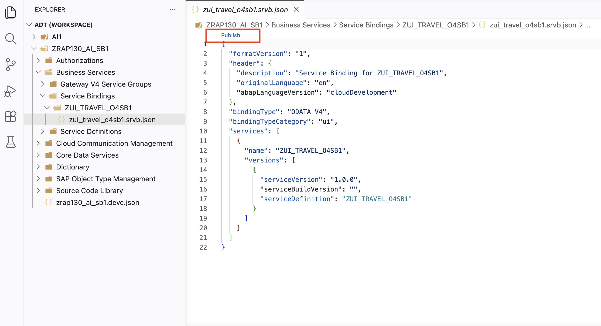
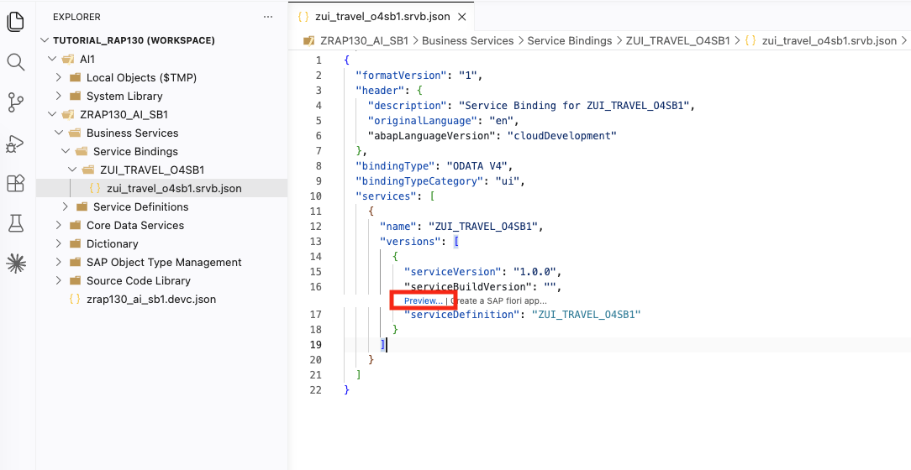
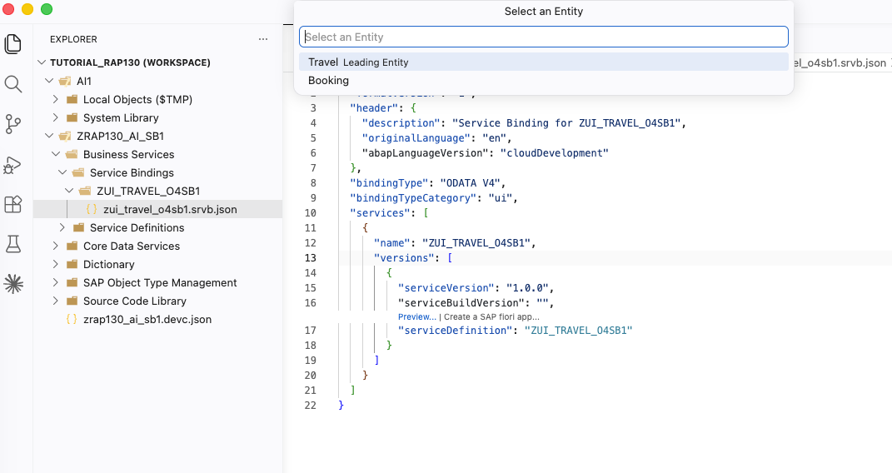
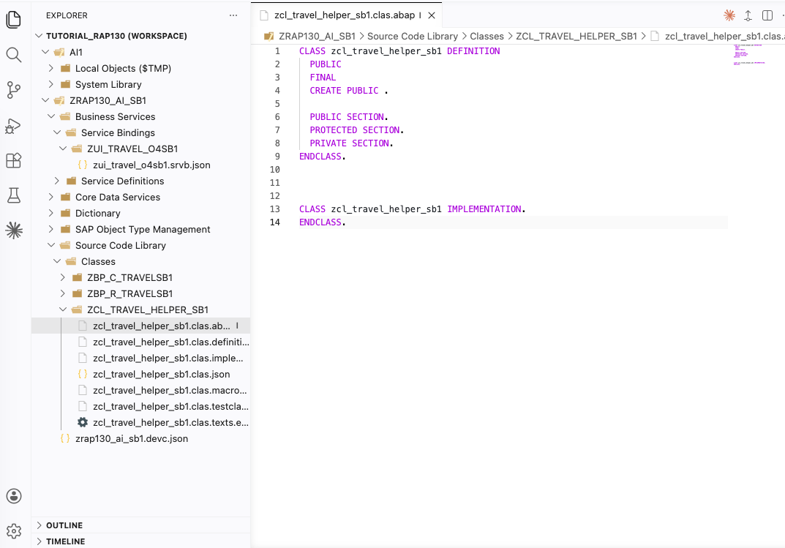

[Home - RAP130 - Build SAP Fiori Apps with ABAP Cloud and SAP Joule for Developers in Visual Studio Code](../../README.md)

# Exercise 3: Publish and Preview the Travel App

## Introduction

In the previous exercise, you generated a complete transactional RAP UI service for Travel and Booking using your coding agent and the ADT MCP tools (_see [Exercise 2](../ex02/README.md)_).

In this exercise, you will publish the local service endpoint of your OData V4 service binding and open the **SAP Fiori elements App Preview** in a browser to see the running Travel application.

### Exercises

- [3.1 - Publish the Service Binding](#exercise-31-publish-the-service-binding)
- [3.2 - Preview the Travel App in the Browser](#exercise-32-preview-the-travel-app-in-the-browser)
- [3.3 - Create ABAP helper class](#exercise-33-create-abap-helper-class)
- [Summary & Next Exercise](#summary--next-exercise)

> ℹ️ **Reminder**: Don't forget to replace all occurrences of the placeholder **`###`** with your group ID in the exercise steps below.

---

## Exercise 3.1: Publish the Service Binding
[^Top of page](#)

> Publish the local service endpoint of the service binding **`ZUI_TRAVEL_O4###`** to make the OData service available for preview and consumption.

<details>
  <summary>🔵 Click to expand!</summary>

1. Open the service binding using **`Ctrl+Shift+A`** and search for **`ZUI_TRAVEL_O4###`**. Select the entry with type **Service Binding** (SRVB).

2. Click the **Publish** button in the editor toolbar (top area of the service binding editor).

   > ℹ️ The "Publish" action registers a local service endpoint that allows the Fiori elements preview and external consumers to discover the service.

   

4. Wait for the publishing to complete. 

   > ✅ You should see on the bottom _Publish/unpublish action in progress_.

</details>

---

## Exercise 3.2: Preview the Travel App in the Browser
[^Top of page](#)

> Open the SAP Fiori elements App Preview for the Travel entity.

<details>
  <summary>🔵 Click to expand!</summary>

1. Open your service binding **`ZUI_TRAVEL_O4###`** and click the **Preview** button.

   

2. Select the `Travel` entity then click **Open** from the pop-up dialog.
   
   

   A browser window opens with the **SAP Fiori elements App Preview** for your Travel application.

2. Try creating a new `Travel` entity:
   - Click **Create** and fill some fields: **Destination**, **Begin Date**, **End Date**
   - Fill in **Agency ID** and **Customer ID** (use any valid IDs from the DMO flight reference data, e.g., `070001` for Agency, `000001` for Customer)
   - Click **Save**

   > ✅ If you can create and save a Travel entry, the app is working correctly!

</details>

---

## Exercise 3.3: Create ABAP helper class
[^Top of page](#)

> Create a helper class to populate the Travel and Booking database tables with demo data from the ABAP Flight Reference Scenario.

<details>
  <summary>🔵 Click to expand!</summary>

Loading demo data makes the app more interesting to work with in the remaining exercises.

1. Open the **Command Palette** (**`Ctrl+Shift+P`**) and type `ABAP: Create new ABAP Object`or use **`Ctrl+Shift+Alt+N`** (macOS: **`Cmd+Option+Shift+N`**)  to create a new ABAP Class.

   - Package: **`ZRAP130_AI_###`**
   - Name: **`ZCL_TRAVEL_HELPER_###`**
   - Description: **`Travel helper class ###`**
  
   You can skip the entries for `Superclass` and `Interface`. The class **`ZCL_TRAVEL_HELPER_###`** should have been created successfully

   


2. Paste the following code into the class, replacing **`###`** with your group ID:

   ```ABAP
   CLASS zcl_travel_helper_### DEFINITION
     PUBLIC
     FINAL
     CREATE PUBLIC.

     PUBLIC SECTION.
       METHODS: validate_customer
                  IMPORTING iv_customer_id TYPE /dmo/customer_id
                  RETURNING VALUE(rv_exists) TYPE abap_bool.

     PROTECTED SECTION.
     PRIVATE SECTION.
   ENDCLASS.

   CLASS zcl_travel_helper_### IMPLEMENTATION.

     METHOD validate_customer.
       SELECT SINGLE
         FROM /dmo/customer
         FIELDS @abap_true AS line_exists
         WHERE customer_id = @iv_customer_id
         INTO @rv_exists.
     ENDMETHOD.

   ENDCLASS.
   ```

3. Save (**`Ctrl+S`**) and activate (**`Ctrl+F3`**) the class.

</details>

---

## Summary & Next Exercise
[^Top of page](#)

Now that you've:
- Published the local service endpoint of the service binding **`ZUI_TRAVEL_O4###`**
- Opened and tested the SAP Fiori elements App Preview in the browser
- Created a test travel entry to verify the app is working
- Created a helper class for future use

You can continue with the next exercise — **[Exercise 4: Add a Validation](../ex04/README.md)**

---
