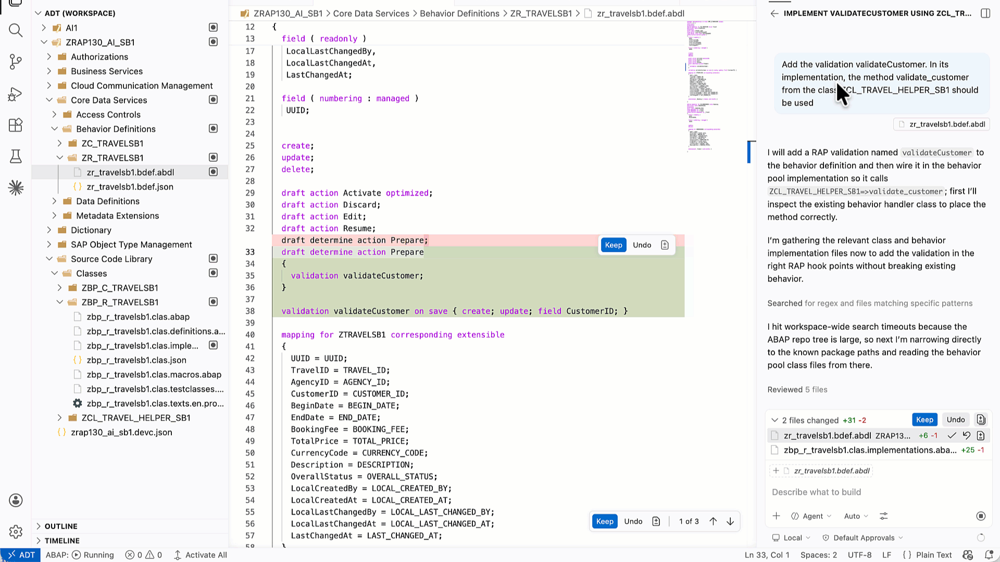
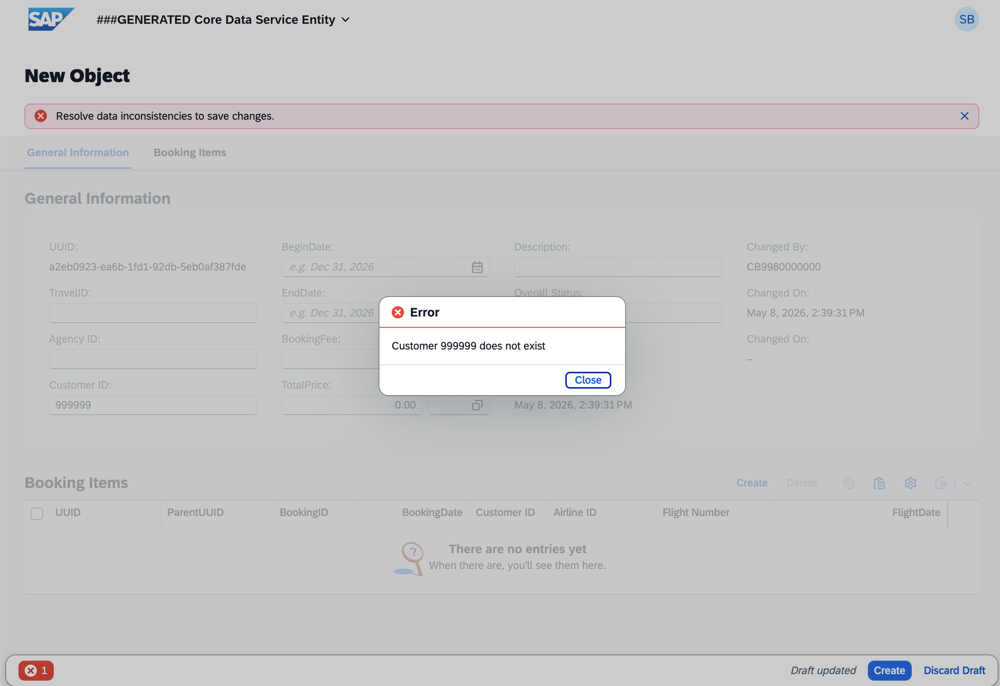

[Home - RAP130 - Build SAP Fiori Apps with ABAP Cloud and SAP Joule for Developers in Visual Studio Code](../../README.md)

# Exercise 4: Add a Validation

## Introduction

In the previous exercise, you generated the SAP Fiori app using the ADT MCP Server (_see [Exercise 3](../ex03/README.md)_).

In this exercise, you will use **your coding agent in Agent mode** to define and implement a backend **validation** called **`validateCustomer`** in a single step — both the behavior definition declaration and the behavior pool implementation will be handled by your coding agent.

### Exercises

- [4.1 - Define and Implement the Validation](#exercise-41-define-and-implement-the-validation)
- [4.2 - Preview and Test the Enhanced Travel App](#exercise-42-preview-and-test-the-enhanced-travel-app)
- [Summary & Next Exercise](#summary--next-exercise)

> ℹ️ **Reminder**: Don't forget to replace all occurrences of the placeholder **`###`** with your group ID in the exercise steps below.

---

## Exercise 4.1: Define and Implement the Validation
[^Top of page](#)

> Use your coding agent in Agent mode to declare `validateCustomer` in the behavior definition **`ZR_TRAVEL###`** and implement it in **`ZBP_R_TRAVEL###`** in one go.

> ⚠ **Warning regarding AI outputs** ⚠
> Please be aware that the outputs generated by AI in this exercise description may differ from yours. **Always review the generated code before activating.**

<details>
  <summary>🔵 Click to expand!</summary>

1. Open the behaviour definition **`ZR_TRAVEL###`** and go to **GitHub Copilot Chat** in **Agent mode**.

   > 💡 **Tip (GitHub Copilot)**: You can start in **Plan mode** first to preview the changes GitHub Copilot intends to make, then switch to **Agent mode** to execute them.

2. Enter the following prompt:

   ```
   Add the validation validateCustomer. In its implementation, the method validate_customer from the ABAP Class ZCL_TRAVEL_HELPER_### should be used. Ask to review changes before proceding with the activation
   ```

   > ℹ️ Replace `###` with your group ID in the prompt before sending it.

3. Your coding agent will propose changes to both the behavior definition and the implementation class. **Review the changes carefully** before confirming.

4. Confirm activation when it asks.

   

5. Your code should look something like this:
  
   > ℹ️ Do not forget to replace **`###`** with your assigned *Group ID* or choosen suffix.

   <details>

      ```ABAP
         CLASS LHC_ZR_TRAVEL### DEFINITION INHERITING FROM CL_ABAP_BEHAVIOR_HANDLER.
            PRIVATE SECTION.
               METHODS:
                  GET_GLOBAL_AUTHORIZATIONS FOR GLOBAL AUTHORIZATION
                  IMPORTING
                     REQUEST requested_authorizations FOR Travel
                  RESULT result,
                  validateCustomer FOR VALIDATE ON SAVE
                  IMPORTING keys FOR Travel~validateCustomer.
         ENDCLASS.

         CLASS LHC_ZR_TRAVEL### IMPLEMENTATION.
            METHOD GET_GLOBAL_AUTHORIZATIONS.
            ENDMETHOD.

            METHOD validateCustomer.
               DATA(lo_travel_helper) = NEW zcl_travel_helper_###( ).

               READ ENTITIES OF zr_travel### IN LOCAL MODE
                  ENTITY Travel
                  FIELDS ( CustomerID )
                  WITH CORRESPONDING #( keys )
                  RESULT DATA(lt_travel).

               LOOP AT lt_travel INTO DATA(ls_travel).
                  IF lo_travel_helper->validate_customer( ls_travel-CustomerID ) = abap_false.
                  APPEND VALUE #( %tky = ls_travel-%tky ) TO failed-travel.
                  APPEND VALUE #(
                     %tky = ls_travel-%tky
                     %msg = new_message_with_text(
                        severity = if_abap_behv_message=>severity-error
                        text     = |Customer { ls_travel-CustomerID } does not exist| ) )
                     TO reported-travel.
                  ENDIF.
               ENDLOOP.
            ENDMETHOD.
         ENDCLASS.
      ```
   </details>

 6. As **OPTIONAL**, you can also experiment and implement the validation `validateCustomer` using **Joule Predictive Code Completion**. Just make sure that its setting is enabled.

   

   - Open the **Command Palette** with **`Ctrl+Shift+P`** (macOS: **`Cmd+Shift+P`**)
   - Type `Preferences: Open Settings (UI)` and select **Preferences: Open Settings...**.
   - In the search bar, type:

      ```
      adt code completion
      ```

   - Locate the setting **"Adt > Joule > Editor: Predictive Code Completion"** and **enable it** by checking the checkbox.

      

</details>

---

## Exercise 4.2: Preview and Test the Enhanced Travel App
[^Top of page](#)

> Test the `validateCustomer` validation in the Fiori elements App Preview.

<details>
  <summary>🔵 Click to expand!</summary>

1. Open the service binding **`ZUI_TRAVEL_O4###`** (use **`Ctrl+Shift+A`** to find it), select the **Travel** entity, and click **Preview**.

2. In the app, click **Create** to start a new travel entry.

3. In the **Customer ID** field, enter an **invalid customer ID** — for example, `999999`.

4. Click **Save**.

   > ✅ The app should display a validation error message: **"Customer 999999 does not exist"** (or similar). The save is rejected.

   

6. Now correct the **Customer ID** to a valid one (e.g., `000001`) and click **Save** again.

   > ✅ The travel entry is saved successfully.

</details>

---

## Summary & Next Exercise
[^Top of page](#)

Now that you've:
- Used your coding agent in Agent mode to define and implement the `validateCustomer` validation in one step
- Tested the validation in the Fiori elements App Preview — confirming that invalid customer IDs are rejected

you can continue with the optional exercises:
- **[Exercise 5: Generate ABAP Unit Tests](../ex05/README.md)**
- **[Exercise 6: Debug ABAP Code in Visual Studio Code](../ex06/README.md)**

---
