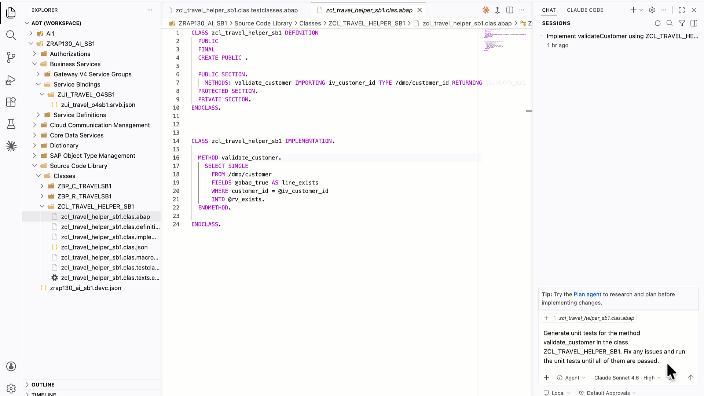
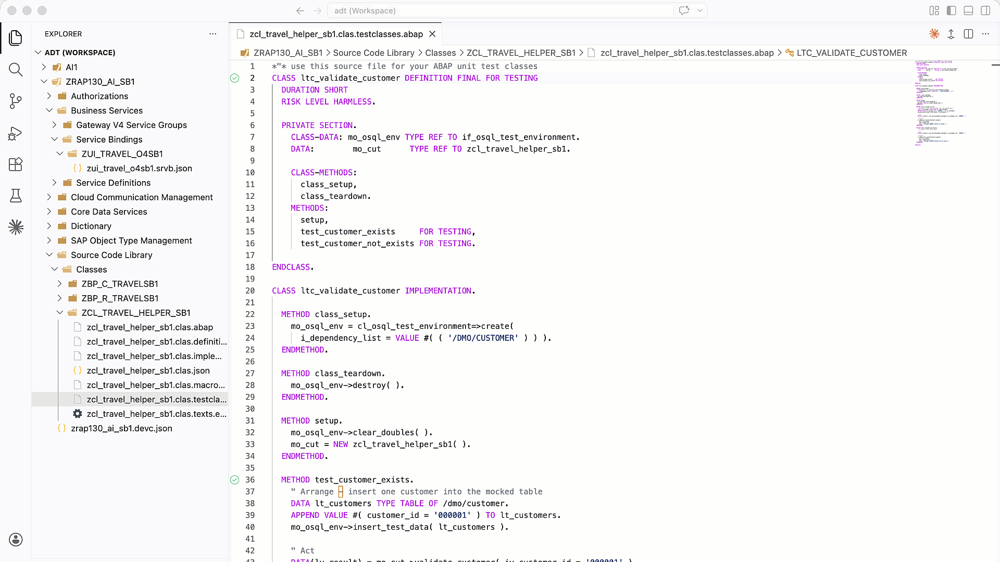

[Home - RAP130 - Build SAP Fiori Apps with ABAP Cloud and SAP Joule for Developers in Visual Studio Code](../../README.md)

# Exercise 5: Generate ABAP Unit Tests 💎

## Introduction

In the previous exercise, you added a backend validation to check customer IDs (_see [Exercise 4](../ex04/README.md)_).

In this exercise, you will generate ABAP unit tests for the helper class **`ZCL_TRAVEL_HELPER_###`**, fix any issues, and run the tests — all in a single step.

### Exercises

- [5.1 - Generate and Run Unit Tests](#exercise-51-generate-and-run-unit-tests-)
- [Summary](#summary)

> ℹ️ **Reminder**: Don't forget to replace all occurrences of the placeholder **`###`** with your group ID in the exercise steps below.

---

## Exercise 5.1: Generate and Run Unit Tests 💎
[^Top of page](#)

> Use your coding agent in Agent mode to generate unit tests for **`ZCL_TRAVEL_HELPER_###`**, fix any issues, and run the tests until all pass.

> ⚠ **Warning regarding AI outputs** ⚠
> Please be aware that the outputs generated by AI in this exercise description may differ from yours. **Always review the generated test code before running it.**

<details>
  <summary>🔵 Click to expand!</summary>

1. Open **GitHub Copilot Chat** in **Agent mode**.

   > 💡 **Tip (GitHub Copilot)**: You can start in **Plan mode** first to preview the changes GitHub Copilot intends to make, then switch to **Agent mode** to execute them.

2. Enter the following prompt:

   ```
   Generate unit tests for the method validate_customer in the class ZCL_TRAVEL_HELPER_###. Fix any issues and run the unit tests until all of them are passed.
   ```

   > ℹ️ Replace `###` with your group ID in the prompt before sending it.

3. Your coding agent will create the test class, generate test methods, fix any issues, and run the tests iteratively until all pass. During this process it will call the MCP tools **`abap_activate-objects`** and **`abap_run_unit_tests`** — allow these tool calls when prompted.

4. Review the test results in the **Test Results** panel.

   

5. Optionally, double-check by running the unit tests manually: open the **Command Palette** (**`Ctrl+Shift+P`** / **`Cmd+Shift+P`**) and select **"ABAP: Run Unit Tests"**.

   

6. Your code should look something like this:
   
   > ℹ️ Do not forget to replace **`###`** with your assigned *Group ID* or choosen suffix.

   <details>

      ```ABAP
        
      CLASS ltc_validate_customer DEFINITION FINAL FOR TESTING
         DURATION SHORT
         RISK LEVEL HARMLESS.

         PRIVATE SECTION.
            CLASS-DATA: mo_osql_env TYPE REF TO if_osql_test_environment.
            DATA:        mo_cut      TYPE REF TO zcl_travel_helper_###.

            CLASS-METHODS:
               class_setup,
               class_teardown.
            METHODS:
               setup,
               customer_exists     FOR TESTING,
               customer_not_exists FOR TESTING.

      ENDCLASS.

      CLASS ltc_validate_customer IMPLEMENTATION.

         METHOD class_setup.
            mo_osql_env = cl_osql_test_environment=>create(
               i_dependency_list = VALUE #( ( '/DMO/CUSTOMER' ) ) ).
         ENDMETHOD.

         METHOD class_teardown.
            mo_osql_env->destroy( ).
         ENDMETHOD.

         METHOD setup.
            mo_osql_env->clear_doubles( ).
            mo_cut = NEW zcl_travel_helper_###( ).
         ENDMETHOD.

         METHOD customer_exists.
            " Arrange – insert one customer into the mocked table
            DATA lt_customers TYPE TABLE OF /dmo/customer.
            APPEND VALUE #( customer_id = '000001' ) TO lt_customers.
            mo_osql_env->insert_test_data( lt_customers ).

            " Act
            DATA(lv_result) = mo_cut->validate_customer( iv_customer_id = '000001' ).

            " Assert
            cl_abap_unit_assert=>assert_equals(
               act = lv_result
               exp = abap_true
               msg = 'Customer 000001 should be found' ).
         ENDMETHOD.

         METHOD customer_not_exists.
            " Arrange – table stays empty

            " Act
            DATA(lv_result) = mo_cut->validate_customer( iv_customer_id = '999999' ).

            " Assert
            cl_abap_unit_assert=>assert_equals(
               act = lv_result
               exp = abap_false
               msg = 'Customer 999999 should not be found' ).
         ENDMETHOD.

      ENDCLASS.
      ```
   </details>
</details>

---

## Summary
[^Top of page](#)

Congratulations! You have completed all exercises of this workshop.

In this final exercise, you:
- Used your coding agent in Agent mode to generate unit tests for `ZCL_TRAVEL_HELPER_###` in one step
- Let your coding agent fix any issues and run the tests iteratively until all passed

You can continue with the other optional exercises:
- **[Exercise 6: Debug ABAP Code in Visual Studio Code](../ex06/README.md)**
- **[Exercise 7: Create a Custom Agent](../ex07/README.md)**

---

### What you built in this workshop

Over the course of RAP130, you have:

1. ✅ Set up Visual Studio Code with the ADT extension and connected to an ABAP system
2. ✅ Enabled and configured the ADT MCP Server with your coding agent
3. ✅ Generated a complete transactional RAP Fiori app via AI-driven MCP tool calls
4. ✅ Explored and adjusted the generated artifacts in Visual Studio Code
5. ✅ Published the service and previewed the SAP Fiori elements app in the browser
6. ✅ Added a validation
7. ✅ Generated and ran ABAP unit tests 

**[↑ Back to Tutorial Home](../../README.md)**

---
