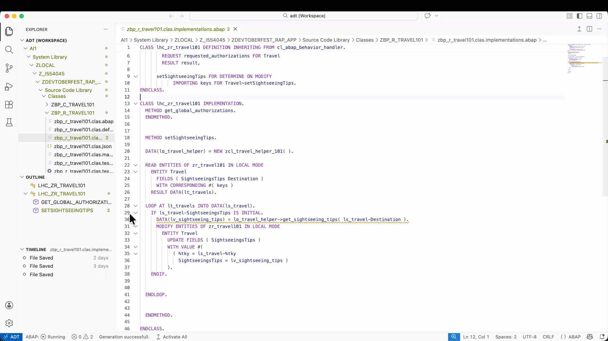
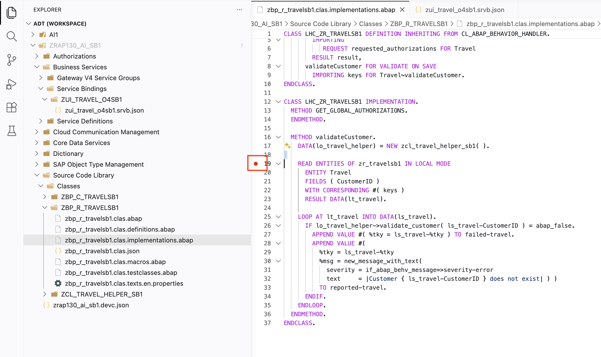

[Home - RAP130 - Build SAP Fiori Apps with ABAP Cloud and SAP Joule for Developers in Visual Studio Code](../../README.md)

# Exercise 6: Debug ABAP Code in Visual Studio Code _(Optional)_

## Introduction

In this exercise, you will learn how to debug ABAP backend code directly from **Visual Studio Code** using the built-in ABAP debugger. You will set breakpoints in the behavior pool **`ZBP_R_TRAVEL###`**, trigger the debugger from the Fiori elements App Preview, and inspect variables and call stacks — all without leaving Visual Studio Code.

### Exercises

- [6.1 - Understand the Visual Studio Code Debugger for ABAP](#exercise-61-understand-the-visual-studio-code-debugger-for-abap)
- [6.2 - Set Breakpoints in the implementation class](#exercise-62-set-breakpoints-in-the-implementation-class)
- [6.3 - Trigger and Attach the Debugger](#exercise-63-trigger-and-attach-the-debugger)
- [6.4 - Inspect Variables and Step Through Code](#exercise-64-inspect-variables-and-step-through-code)
- [6.5 - Use the Watch View and Call Stack](#exercise-65-use-the-watch-view-and-call-stack)
- [Summary](#summary)

> ℹ️ **Reminder**: Don't forget to replace all occurrences of the placeholder **`###`** with your group ID in the exercise steps below.

---

## About the ABAP Debugger in Visual Studio Code

  
Click to expand!

The ADT for Visual Studio Code extension brings the full **ABAP debugger** into Visual Studio Code. The debugger connects to the ABAP backend and provides:

- **Breakpoints** set directly in the Visual Studio Code editor (click in the gutter next to the line number)
- **Step Into / Step Over / Step Return / Continue** controls in the Debug toolbar
- **Variables** panel — inspect local variables, parameters, and field symbols at runtime
- **Watch** — monitor specific variables or expressions as you step through code
- **Call Stack** — see the full call hierarchy and jump to any frame
- **Logpoints** — print a message without stopping execution (no need to modify code)

The debugger works with all ABAP object types supported by ADT for Visual Studio Code.

> **Further reading**: [Visual Studio Code Run and Debug Documentation](https://code.visualstudio.com/docs/editor/debugging)

Here is an example of how debugging looks in Visual Studio Code — the steps below will walk you through this flow.

---

## Exercise 6.1: Understand the Visual Studio Code Debugger for ABAP
[^Top of page](#)

> Get familiar with the **Run & Debug** view and its components before setting your first breakpoint.

  
🔵 Click to expand!

1. Open the **Run & Debug** view by clicking the bug/play icon in the **Activity Bar** (left edge of Visual Studio Code), or press **`Ctrl+Shift+D`** (macOS: **`Cmd+Shift+D`**).

2. Review the panels visible in this view:

   | Panel | Purpose |
   |-------|---------|
   | **Variables** | Shows local variables, parameters, and their current values at a breakpoint |
   | **Watch** | Monitor specific expressions or variable names you define |
   | **Call Stack** | Shows the call hierarchy — click any frame to jump to that code location |
   | **Breakpoints** | Lists all breakpoints set across your workspace; enable/disable individual ones |

3. The **Debug toolbar** appears at the top of the editor when a debug session is active:

   | Button | Shortcut | Action |
   |--------|----------|--------|
   | Continue | **`F5`** | Run until the next breakpoint |
   | Step Over | **`F10`** | Execute the current line and move to the next |
   | Step Into | **`F11`** | Step into a called method |
   | Step Return | **`Shift+F11`** | Run until the current method returns |
   | Stop | **`Shift+F5`** | Terminate the debug session |

   You can find more information [here](https://code.visualstudio.com/docs/debugtest/debugging)

---

## Exercise 6.2: Set Breakpoints in the implementation class
[^Top of page](#)

> Set breakpoints in the `validateCustomer` method of **`ZBP_R_TRAVEL###`** so you can inspect the validation logic at runtime.

  
🔵 Click to expand!

1. Open the behavior pool **`ZBP_R_TRAVEL###`** using **`Ctrl+Shift+A`**.

2. Navigate to the **`validateCustomer`** method implementation. You can use the **Outline** view (left sidebar) to jump directly to it, or use **`Ctrl+Shift+O`** to go to a symbol in the file.

3. **Set a breakpoint** on the first executable line inside `validateCustomer` (e.g., the `READ ENTITIES` statement):
   - Click in the **gutter** — the narrow strip to the left of the line numbers.
   - A red dot appears, indicating the breakpoint is set.

   

4. Set a second breakpoint a few lines later — for example, on the `LOOP AT travels` line — so you can step through the loop.

5. Verify both breakpoints appear in the **Breakpoints** section of the **Run & Debug** view.

   > ℹ️ **Hint**: You can **disable** a breakpoint temporarily by clicking its red dot (turns grey). This lets you keep it without stopping every time. Right-click a breakpoint for more options (Edit Condition, Add Logpoint, etc.).

   > ℹ️ **Logpoints**: Right-click in the gutter and select **Add Logpoint** to print a message to the Debug Console without stopping execution. Useful for tracing values without interrupting the app flow.

---

## Exercise 6.3: Trigger and Attach the Debugger
[^Top of page](#)

> Launch a debug session and trigger your breakpoint by using the Travel app in the browser.

  
🔵 Click to expand!

### Trigger the breakpoints from the Fiori app

4. Open (or refresh) the **Fiori elements App Preview**:
   - Open the service binding **`ZUI_TRAVEL_O4###`** via **`Ctrl+Shift+A`**
   - Select the **Travel** entity and click **Preview**

5. In the app, click **Create** to start a new travel entry.

6. Fill in the fields — including a **Customer ID** (use any value, valid or not — e.g., `000001`).

7. Click **Save**.

8. The ABAP backend executes `validateCustomer` on save. Visual Studio Code **automatically comes to the foreground** and execution halts at your first breakpoint.

---

## Exercise 6.4: Inspect Variables and Step Through Code
[^Top of page](#)

> Use the Variables panel and debug controls to inspect runtime data and step through the validation logic.

  
🔵 Click to expand!

1. With execution halted at the `READ ENTITIES` line, look at the **Variables** panel in the Run & Debug view.

   You will see local variables and parameters, including:
   - `keys` — the internal table of Travel keys passed to the validation
   - Any other method parameters

2. **Expand** the `keys` variable by clicking the arrow. Inspect the individual key entries (UUID, etc.).

3. Press **`F10`** (Step Over) to execute the `READ ENTITIES` statement.

4. After the step, the `travels` variable is now populated. Expand it in the Variables panel to see the Travel instances that were read, including the `CustomerID` field.

5. Press **`F10`** again to step over the customer `SELECT` statement. After it executes, inspect the `customers` internal table — it should contain the matching customer records (or be empty for an invalid ID).

6. Press **`F10`** to enter the `LOOP AT travels`. At each iteration, hover over `travel` in the code — Visual Studio Code shows a tooltip with the current value of that variable.

   > ℹ️ **Hint**: You can hover over **any variable or field** in the editor while at a breakpoint to see its current runtime value in a tooltip.

7. Press **`F5`** (Continue) to resume execution and let the app complete the save operation.

---

## Exercise 6.5: Use the Watch View and Call Stack
[^Top of page](#)

> Add a Watch expression and inspect the call stack to understand the full execution context.

  
🔵 Click to expand!

### Add a Watch expression

1. Trigger the breakpoint again (create another Travel entry in the app and click Create).

2. In the **Variables** panel in the Run & Debug view, right-click on the variable that you want to add to the watch, then select **Add to Watch**.

3. The Watch panel now shows the selected variable as execution steps through the loop — without you having to expand the variable tree each time.

   > ℹ️ **Hint**: You can add any valid ABAP field or expression as a Watch entry. Useful for monitoring deeply nested fields.

### Inspect the call stack

5. Look at the **Call Stack** panel. It shows the full call hierarchy that led to `validateCustomer`:
   - The RAP framework trigger (determination/validation dispatcher)
   - The behavior pool method `validateCustomer`
   - Any called sub-methods

6. Click on any frame in the Call Stack to jump to that location in the code — the editor navigates to that file and line automatically.

### End the debug session

7. Press **`Shift+F5`** (Stop) or click the red **Stop** button in the Debug toolbar to end the debug session.

8. Your breakpoints remain set for future sessions — remove them by clicking the red dots in the gutter, or use **"Remove All Breakpoints"** from the Breakpoints panel context menu.

---

## Summary
[^Top of page](#)

In this exercise, you learned how to:
- Navigate the **Run & Debug** view and understand its panels (Variables, Watch, Call Stack, Breakpoints)
- Set **breakpoints** and **logpoints** directly in the Visual Studio Code editor gutter
- Start an ABAP debug session and **trigger it from the Fiori elements App Preview**
- **Step through ABAP code** using Step Over, Step Into, and Step Return
- **Inspect runtime values** in the Variables panel and by hovering over variables in the editor
- Use **Watch expressions** to monitor specific fields through loop iterations
- Navigate the **Call Stack** to understand the execution context

These debugging skills apply to any ABAP object in your system — not just RAP behavior pools. Use the same approach for ABAP classes, function modules, and more.

You can continue with the other optional exercise:
- **[Exercise 7: Create a Custom Agent](../ex07/README.md)**

**[↑ Back to Tutorial Home](../../README.md)**

---
