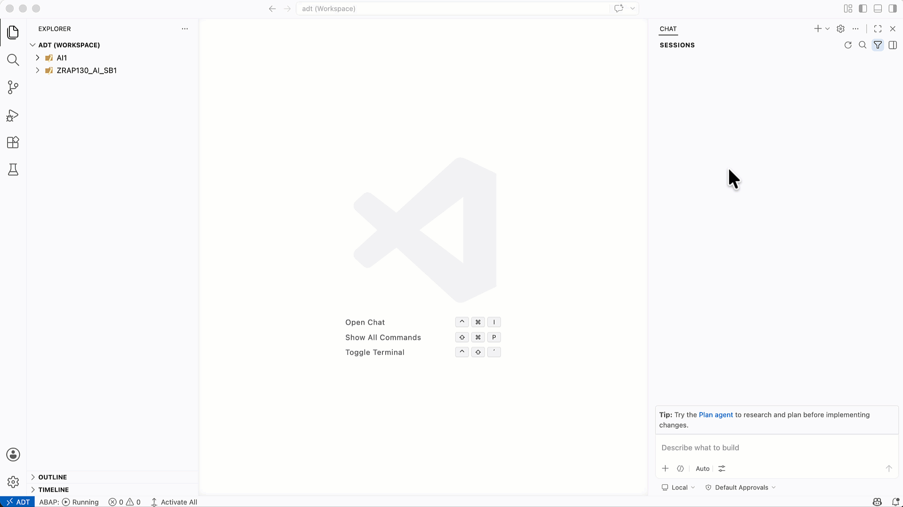

[Home - RAP130 - Build SAP Fiori Apps with ABAP Cloud and SAP Joule for Developers in Visual Studio Code](../../README.md)

# Exercise 7: Create a Custom Agent _(Optional)_

## Introduction

In this exercise, you will create a **custom agent** to tailor your coding agent's behaviour for ABAP development in this workshop. A custom agent lets you define specific instructions, naming conventions, context, and tool preferences — so your agent behaves consistently without you having to repeat the same guidance in every prompt.

For ABAP development with RAP130, a custom agent is useful for telling your coding agent to:
- Always use the ADT MCP tools for ABAP operations
- Follow RAP naming conventions and use the correct package/group ID
- Keep ABAP code style consistent with ABAP Cloud restrictions

> ℹ️ **Note**: The steps in this exercise differ depending on which coding agent you are using:
> - **GitHub Copilot** — use the built-in Visual Studio Code command to create the custom agent
> - **Other coding agents** (e.g. Cursor, Cline, etc.) — create an `agent.md` file manually

The official documentation provides an [example of a custom agent for ABAP development](https://help.sap.com/docs/abap-cloud/abap-development-tools-for-visual-studio-code/agent-configuration?locale=en-US) that helps you get started.

### Exercises

- [7.1 - Create a Custom Agent (GitHub Copilot)](#exercise-71-create-a-custom-agent-github-copilot-)
- [7.2 - Create a Custom Agent (Other Coding Agents)](#exercise-72-create-a-custom-agent-other-coding-agents-)
- [Summary](#summary)

> ℹ️ **Reminder**: Don't forget to replace all occurrences of the placeholder **`###`** with your group ID in the exercise steps below.

---

## Exercise 7.1: Create a Custom Agent (GitHub Copilot) 💎
[^Top of page](#)

> Use the agent selector in GitHub Copilot Chat to create a custom agent for ABAP development.

<details>
  <summary>🔵 Click to expand!</summary>

1. Open **GitHub Copilot Chat** (**`Ctrl+Shift+I`** / **`Cmd+Shift+I`**).

2. In the chat input bar, click the **agent selector icon** (`</>`) to open the agent dropdown.

3. Select **"Configure Custom Agents..."** at the bottom of the list. Then click on **"+ Create new custom agent..."**

   

4. Visual Studio Code opens a new `agent.md` file for editing (stored in `.github/` in your workspace).

5. Replace the default content with instructions tailored for this RAP130 workshop. For example:

   ```markdown
   # ABAP RAP130 Custom Agent

   You are an ABAP developer building a transactional SAP Fiori elements app using the RAP framework and the ADT MCP Server in Visual Studio Code.

   ## Rules
   - Always use the ADT MCP tools (`abap_generators-*`, `abap_creation-create_object`, `abap_activate-objects`, etc.) for all ABAP backend operations — never generate ABAP code manually when an MCP tool can do it.
   - My group ID suffix is `###`. Use this suffix in all artifact names (e.g., `ZRAP130_AI_###`, `ZTRAVEL###`, `ZR_TRAVEL###`).
   - Package for all objects: `ZRAP130_AI_###`.
   ```

   > ℹ️ Replace `###` with your group ID in the agent instructions above.

6. **Save** the file (**`Ctrl+S`** / **`Cmd+S`**).

7. Click the agent selector icon (`</>`) again — your new custom agent now appears in the list. Select it to activate it.

   > ✅ Once selected, Copilot will apply the custom agent instructions automatically to every prompt.

</details>

---

## Exercise 7.2: Create a Custom Agent (Other Coding Agents) 💎
[^Top of page](#)

> Manually create an `agent.md` file to customise the behaviour of your coding agent (Cursor, Cline, or other MCP-compatible agents).

> ℹ️ **About `agent.md`**: [`agent.md`](https://agents.md/) is an open standard for defining agent behaviour via a Markdown file. See [agents.md](https://agents.md/) for the full specification and examples.

<details>
  <summary>🔵 Click to expand!</summary>

1. In Visual Studio Code, create a new file at the root of your workspace named **`agent.md`**.

   > ℹ️ **Hint**: Right-click the Explorer panel and select **New File**, then name it `agent.md`.

2. Add instructions tailored for this RAP130 workshop. For example:

   ```markdown
   # ABAP RAP130 Custom Agent

   You are an ABAP developer building a transactional SAP Fiori elements app using the ABAP RestFul Application  framework and the ADT MCP Server in Visual Studio Code.

   ## Rules
   - Always use the ADT MCP tools (`abap_generators-*`, `abap_creation-create_object`, `abap_activate-objects`, etc.) for all ABAP backend operations — never generate ABAP code manually when an MCP tool can do it.
   - My group ID suffix is `###`. Use this suffix in all artifact names (e.g., `ZRAP130_AI_###`, `ZTRAVEL###`, `ZR_TRAVEL###`).
   - Package for all objects: `ZRAP130_AI_###`.
   ```

   > ℹ️ Replace `###` with your group ID in the agent instructions above.

3. **Save** the file (**`Ctrl+S`** / **`Cmd+S`**).

4. Open your coding agent and verify it picks up the `agent.md` file. The exact mechanism depends on your agent — consult its documentation for how it loads custom instructions.

   > ✅ Once loaded, your agent will apply these instructions automatically to every prompt.

</details>

---

## Summary
[^Top of page](#)

In this exercise, you:
- Created a custom agent definition to tailor your coding agent's behaviour for ABAP RAP development
- Configured the agent with your group ID, package name, naming conventions, and a preference for ADT MCP tool use

A custom agent saves time across all exercises: you no longer need to repeat context about your group ID, package, or RAP conventions in every prompt.

**[↑ Back to Tutorial Home](../../README.md)**

---
